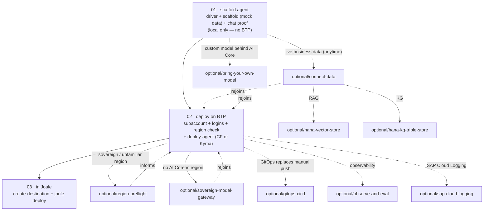

# Recipes

**One recipe per checkpoint — the folder number is the checkpoint number.** These are the playbooks behind the guided flow: in Claude Code, `/start` reads and executes them checkpoint by checkpoint, and you can also run them by hand, in order. The scaffold ships with **mock data**, so the linear track needs no backend system at all — connecting live business data is an opt-in ([`optional/connect-data`](optional/connect-data/)). The worked example throughout is a **Sales Order Agent**; your own agent follows the same shape with a different purpose — the toolkit's `--prompt` spec workflow tailors the scaffold to whatever you tell it.

> ℹ **Not on Claude Code?** Read [`AGENTS.md`](../AGENTS.md), then use the locally built toolkit MCP server (Codex, Cursor, OpenCode, Gemini CLI, Cline) or the raw shell scripts. Run `./scripts/build-toolkit-mcp.sh`; the MCP package is not published. See [`docs/harnesses.md`](../docs/harnesses.md) and the vendored [`SCRIPTS.md`](../toolkits/a2a-agent-toolkit/SCRIPTS.md). Same inputs, same outputs.

## Layout

```
recipes/
  01-scaffold-agent/  checkpoint 1 — toolkit driver + scaffold (mock data) + local chat proof; no BTP
  02-deploy-btp/      checkpoint 2 — first BTP touchpoint: subaccount, logins, region, deploy CF/Kyma
  03-joule/           checkpoint 3 — wire the deployed agent into Joule (where available)
  optional/           pull in only when the situation calls for it (incl. connect-data, RAG, KG, observability)
```

## The flow

From the Cookbook root, clone the toolkit and launch Claude Code with the plugin (`git clone https://github.com/SAP-samples/joule-a2a-agent-toolkit.git toolkits/a2a-agent-toolkit && claude --plugin-dir toolkits/a2a-agent-toolkit`), then type **`/start`**. It asks three questions — what your agent should do, which LLM endpoint you have, whether you have a BTP subaccount yet — then drives the checkpoints, persisting every decision and completed step in `pilot-config.env` (gitignored) so any later session resumes where you left off.

| Checkpoint | Result you'll see | Needs |
|---|---|---|
| [**01 · Scaffold your agent**](01-scaffold-agent/) | your agent replies on localhost — mock data, tailored to your purpose | a supported coding harness + one LLM endpoint |
| [**02 · Deploy on BTP**](02-deploy-btp/) | a public agent URL (Cloud Foundry or Kyma) | a BTP subaccount with CF or Kyma — first step that needs one |
| [**03 · In Joule**](03-joule/) | the agent answering inside Joule | a Joule-enabled tenant (region-dependent) |

Want live business data? Take [`optional/connect-data`](optional/connect-data/) anytime after checkpoint 1 — before or after deploying (`deploy-agent` is idempotent).



Each recipe opens with a **Guided** callout naming its checkpoint and a paste-able prompt for entering the flow mid-way, and every Input literally names the producing step's Output — the same project accumulates one capability per step.

## Optional — pull in when needed

| Recipe | When | Relationship |
|---|---|---|
| [connect-data](optional/connect-data/) | the pilot needs live business data (S/4HANA, SuccessFactors, any HTTP API) instead of the scaffold's mock data | Branch off checkpoint 1, anytime — free api.sap.com sandbox path included. Rejoins at checkpoint 2. |
| [region-preflight](optional/region-preflight/) | the target region is sovereign, regulated, or unfamiliar | Diagnostic for checkpoint 2 — Discovery Center check + entitlement dump + LLM-path tier table. Commercial hubs can skip it. |
| [sovereign-model-gateway](optional/sovereign-model-gateway/) | AI Core is unavailable/blocked (China Landing, NS2, KSA non-regulated, or EU Access without cross-region routing) | Swaps the model provider to `--llm-provider openai-compatible` against a customer-approved gateway. Rejoins at checkpoint 2. |
| [bring-your-own-model](optional/bring-your-own-model/) | the customer hosts a custom LLM behind AI Core (e.g. Ollama serving Gemma) | Replaces the default catalog model behind `--llm-provider aicore`. Rejoins at checkpoint 2. |
| [gitops-cicd](optional/gitops-cicd/) | the team wants Argo CD reconciliation instead of a manual `cf push` / `helm upgrade` | Replaces checkpoint 2's manual push with a GitOps pipeline. |
| [hana-vector-store](optional/hana-vector-store/) | the agent needs RAG over documents | Layers on optional/connect-data — adds a `DOCS` vector table + `retrieve_context(query, k)` tool. |
| [hana-kg-triple-store](optional/hana-kg-triple-store/) | the agent needs knowledge graph traversal | Layers on optional/connect-data — adds a HANA graph workspace + `graph_query(nl_question)` tool. |
| [observe-and-eval](optional/observe-and-eval/) | the deployed agent needs observability and evaluation | Layers on checkpoint 2 — adds structured logging, OTel middleware, and an eval harness. |
| [sap-cloud-logging](optional/sap-cloud-logging/) | the Kyma-deployed agent needs SAP Cloud Logging integration | Layers on checkpoint 2 (Kyma) — wires telemetry pipelines to SAP Cloud Logging. |

## Adding a recipe

1. Mirror the frontmatter of [`02-deploy-btp/README.md`](02-deploy-btp/README.md) at the top of the new recipe's `README.md`.
2. Numbered checkpoint recipes are reserved for the linear track; new material goes to `optional/` (opt-in) with a descriptive slug.
3. Open with the `> **Guided:** / **Flow:** / **Input:** / **Output:** / **Toolkit command:**` callout — the Guided line names the checkpoint it serves plus a paste-able mid-flow prompt, and the Input must literally name the producing step's Output.
4. Include `## Verify it works` — with a chat proof (a real message and the expected reply), not just the agent-card curl, wherever the recipe produces a runnable agent.
5. PR with the CONTRIBUTING checklist.
